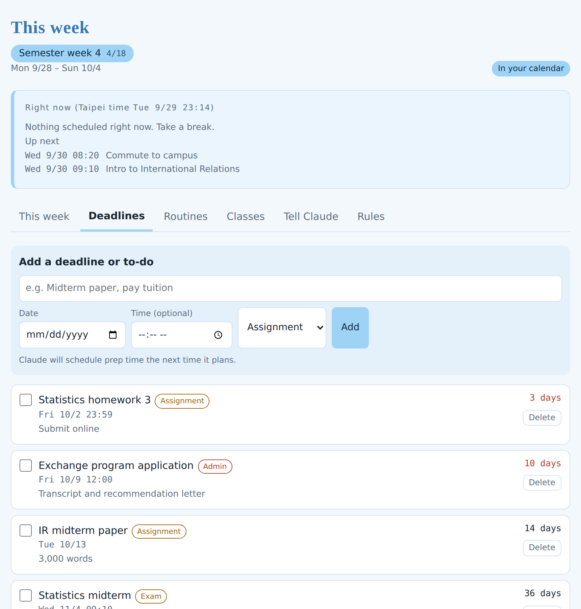
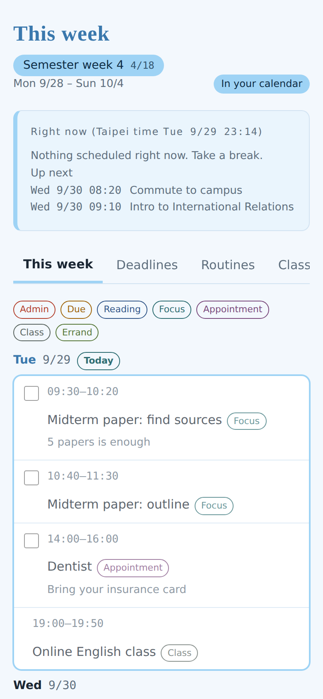
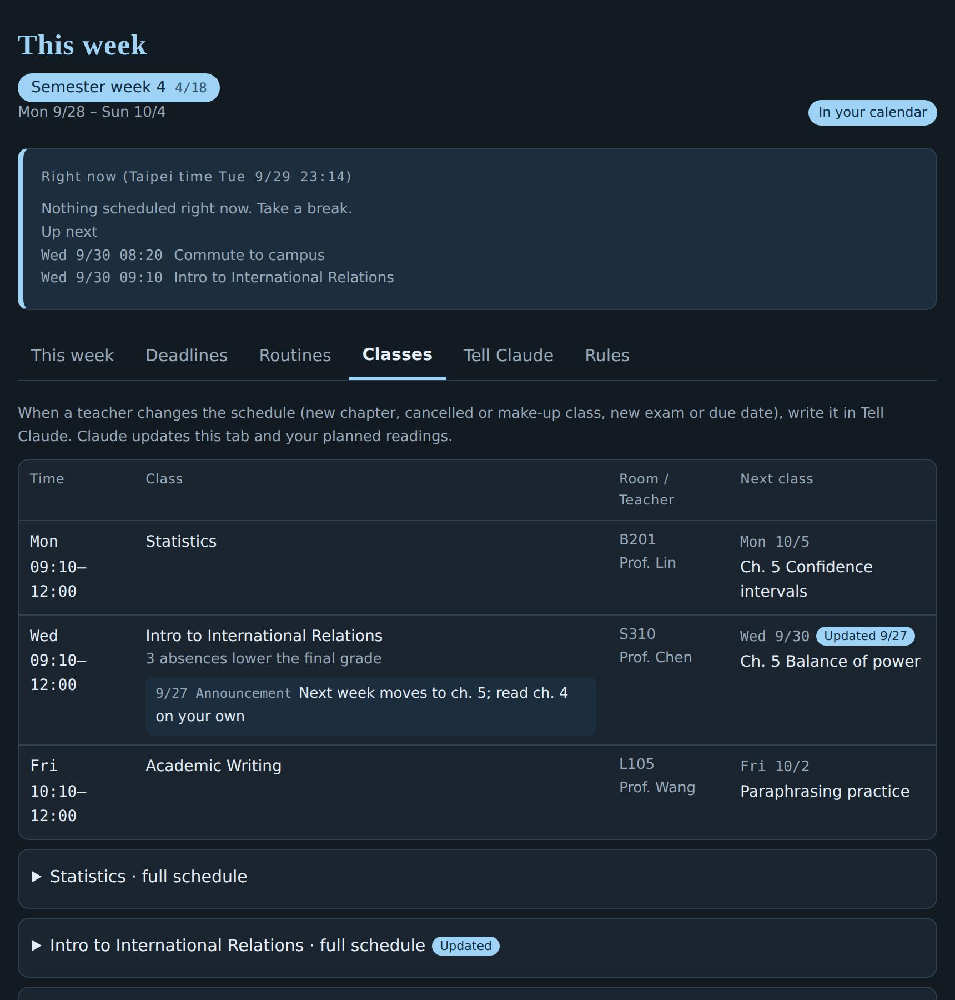

# 週行程排程助理 Weekly Planner Skill

一個給 Claude 用的非官方 skill · An unofficial skill for Claude · v1.1.0

[中文](#中文) · [English](#english) · [完整教學](docs/guide.md) · [Full guide](docs/guide.en.md)

<p>
  
  
</p>

<sub>截圖中的資料都是虛構的範例。Screenshots use made-up demo data.</sub>

---

## 中文

### 關於這個專案

這是一個以 Claude 為基礎的 skill，把 AI 助理和日程安排結合在一起。它用 Claude 本身的兩個功能當基石：**排程任務**讓 Claude 在固定時間自己醒來，每週跟你確認下週行程、每天處理變動；**互動式頁面**是一個只屬於你的網頁，打開就知道現在該做什麼。

它以 ADHD 的需求為出發點設計，目標是給很難自己安排時間的人，一種過有條理生活的可能性：不是再給你一張待辦清單，而是直接告訴你幾點做什麼、要做多久，並替你留好休息和空白。任何覺得時間很難自己分配的人也都能用。

這個專案最初是為了作者自己的日常需要而做，實際用過一段時間後，整理成任何人都能設定的公開版本。

### 它會幫你做什麼

- **排每週行程：** 依課表或班表、通勤、課前閱讀、截止日、例行事項，排出具體時段，並預留休息與空白。
- **寫進日曆：** 寫進 Google 日曆，附上顏色與提醒；iPhone 和 Mac 可以用 Apple 行事曆看。
- **一個隨時看得到的頁面：** 「現在該做」、本週行程、截止日倒數、課前閱讀都在同一頁，做完就打勾，寫錯的截止日或留言可以直接刪除。介面有中文和英文。
- **每週跟你確認：** 固定時間傳下週草稿給你，你確認後才寫進日曆。
- **每天處理變動：** 在頁面留言「週四的課改到 9 點」「老師說下週改上第五章」，它會自動重排；提前做完的事，空出來的時間會拿去排後面的事。

為什麼這樣設計、每個功能對應哪一種困難，請看[完整教學第 2 章](docs/guide.md#2-為什麼這樣設計)。

### 需要準備

- **Claude 付費方案**（Pro、Max、Team、Enterprise）：自動的每週確認與每日檢查靠排程任務，只有付費方案有。免費方案也能設定和排行程，只是每週要自己開對話說「排下週」。
- **開啟 Code execution and file creation**（Settings → Capabilities）：上傳 skill 需要。
- **Google Calendar 連接器**（建議）：只支援 Google 日曆；用其他日曆的話，行程會放在頁面上。

### 快速開始

1. 下載 [`dist/weekly-planner-for-everyone-zh.zip`](dist/weekly-planner-for-everyone-zh.zip)（英文說明版是 [`-en.zip`](dist/weekly-planner-for-everyone-en.zip)，功能相同，裝一個就好），不要解壓縮。
2. 在 Claude 打開 **Customize → Skills**，點 **＋** → **Upload a skill**，選這個 zip。
3. （建議）在 **Customize → Connectors** 連接 Google Calendar。
4. 開一個新對話，輸入「幫我設定週行程排程助理」。選「快速設定」大約 5 分鐘。
5. 設定完成後，到左側欄 **Scheduled**，把兩個排程任務都設成 **Automatically approve**，否則任務會停下來等你按允許。

每一步的詳細說明、截圖、日常用法、手機設定和疑難排解，都在[完整使用教學](docs/guide.md)。

### 範例頁面

[`demo/demo-zh.html`](demo/demo-zh.html) 和 [`demo/demo-en.html`](demo/demo-en.html) 是用虛構資料做的範例，下載後用瀏覽器打開就能看，右上角可以切換中英文。

### 檔案結構

```
weekly-planner-for-everyone/        中文版 skill
├── SKILL.md                        主要規則：使用情境、排程規則、日曆寫入、頁面設計
├── assets/planner-page.html        週行程頁面範本（中英雙語介面）
└── references/                     設定流程、資料結構、排程任務範本
en/weekly-planner-for-everyone/     英文版 skill（同樣結構）
dist/                               打包好的安裝檔
docs/                               完整教學與截圖
demo/                               範例頁面與產生腳本（python3 demo/build-demo.py）
CHANGELOG.md                        版本紀錄
```

### 貢獻

歡迎開 Issue 回報問題，或送 Pull Request。回報時請不要貼上個人行程或頁面連結。修改時請：

- 中文版與英文版一起改，頁面範本兩邊保持一致（只有 `<title>` 不同）。
- 頁面加新文字時，`I18N` 的 `zh` 和 `en` 都要加。
- 重新打包 `dist/` 的 zip（壓縮整個 `weekly-planner-for-everyone` 資料夾），並更新 CHANGELOG。
- 確認沒有放入任何人的個人資料。

### 免責聲明

- **不是醫療工具。** 這個專案以 ADHD 常見的生活困難為設計出發點，但不能取代診斷、治療或專業協助。
- **不是 Anthropic 官方產品。** 這是一個給 Claude 用的非官方 skill，和 Anthropic 沒有合作或背書關係。Claude 是 Anthropic 的商標。
- **AI 可能出錯。** Claude 可能排錯時間或讀錯日期。報名、繳費、考試這類重要截止日，請以學校或官方公告為準。
- **你的資料。** 行程資料存在你自己的 Claude 帳號與 Google 日曆裡，依 Anthropic 與 Google 的隱私政策處理。這個專案本身不收集任何資料。

### 授權

[MIT License](LICENSE) © 2026 PeiYuFeng

---

## English

### About this project

This is a skill built on Claude that brings an AI assistant and your schedule together. It rests on two of Claude's own features: **scheduled tasks** let Claude wake up on its own to check in about next week and handle changes every day, and an **interactive page** that belongs only to you shows what to do right now.

It is designed around the needs of people with ADHD. The goal is to offer people who find it hard to plan their own time a real possibility of a more organized life: instead of another to-do list, it tells you what to do, when, and for how long, and keeps rest and buffer time in your week. Anyone who struggles to plan their time can use it.

The project started as a tool the author built for their own daily life. After using it for a while, they turned it into a public version anyone can set up.

<p>
  
  
</p>

### What it does

- **Plans your week:** puts classes or shifts, commutes, readings, deadlines and routines into specific time slots, with breaks and buffer time.
- **Writes to your calendar:** adds events to Google Calendar with colors and reminders. You can view them in Apple Calendar on iPhone and Mac.
- **Gives you one page to check:** "Right now", this week's plan, deadline countdowns and readings, all on one page you can tick off. Deadlines or notes added by mistake can be deleted right there. The page works in English and Chinese.
- **Checks in every week:** sends you next week's draft at a set time and only writes it to your calendar after you approve.
- **Handles changes every day:** leave a note on the page ("Thursday's class moved to 9", "we're on chapter 5 next week") and it replans. When you finish something early, it uses the freed time for what's next.

For why it's designed this way and which difficulty each feature addresses, see [chapter 2 of the full guide](docs/guide.en.md#2-why-its-designed-this-way).

### What you need

- **A paid Claude plan** (Pro, Max, Team or Enterprise): the automatic weekly check-in and daily check run as scheduled tasks, which only paid plans have. On the free plan you can still set up and plan; you just open a chat each week and say "plan next week".
- **Code execution and file creation turned on** (Settings → Capabilities): needed to upload skills.
- **Google Calendar connector** (recommended): only Google Calendar is supported. With any other calendar, your plan lives on the page.

### Quick start

1. Download [`dist/weekly-planner-for-everyone-en.zip`](dist/weekly-planner-for-everyone-en.zip) (the Chinese edition, [`-zh.zip`](dist/weekly-planner-for-everyone-zh.zip), has the same features; install one). Don't unzip it.
2. In Claude, open **Customize → Skills**, click **+** → **Upload a skill**, and choose the zip.
3. (Recommended) Connect Google Calendar in **Customize → Connectors**.
4. Start a new chat and say "set up my weekly planner". Quick setup takes about 5 minutes.
5. After setup, open **Scheduled** in the left sidebar and set both scheduled tasks to **Automatically approve**, or they will stop and wait for you to approve each step.

Step-by-step details, screenshots, everyday use, phone setup and troubleshooting are in the [full guide](docs/guide.en.md).

### Demo page

[`demo/demo-en.html`](demo/demo-en.html) and [`demo/demo-zh.html`](demo/demo-zh.html) use made-up data. Download one and open it in a browser; the button at the top right switches languages.

### Repository layout

```
weekly-planner-for-everyone/        Chinese edition of the skill
├── SKILL.md                        Main rules: scenarios, planning rules, calendar, page design
├── assets/planner-page.html        Planner page template (English and Chinese UI)
└── references/                     Setup flow, data schema, scheduled task prompts
en/weekly-planner-for-everyone/     English edition (same layout)
dist/                               Installable zips
docs/                               Full guides and screenshots
demo/                               Demo pages and build script (python3 demo/build-demo.py)
CHANGELOG.md                        Version history
```

### Contributing

Issues and pull requests are welcome. Please don't paste your personal schedule or page link into an issue. When you make changes:

- Update both editions, and keep the page template identical in both (only `<title>` differs).
- Add any new page text to both `zh` and `en` in `I18N`.
- Rebuild the zips in `dist/` (zip the whole `weekly-planner-for-everyone` folder) and update the CHANGELOG.
- Make sure no personal data is included.

### Disclaimer

- **Not a medical tool.** The project is designed around everyday difficulties common with ADHD, but it is not a substitute for diagnosis, treatment or professional support.
- **Not an official Anthropic product.** This is an unofficial skill for Claude, not affiliated with or endorsed by Anthropic. Claude is a trademark of Anthropic.
- **AI can make mistakes.** Claude may schedule something wrong or misread a date. For important deadlines such as registrations, payments and exams, rely on your school's or the official announcement.
- **Your data.** Your schedule is stored in your own Claude account and Google Calendar, handled under Anthropic's and Google's privacy policies. This project itself collects no data.

### License

[MIT License](LICENSE) © 2026 PeiYuFeng
