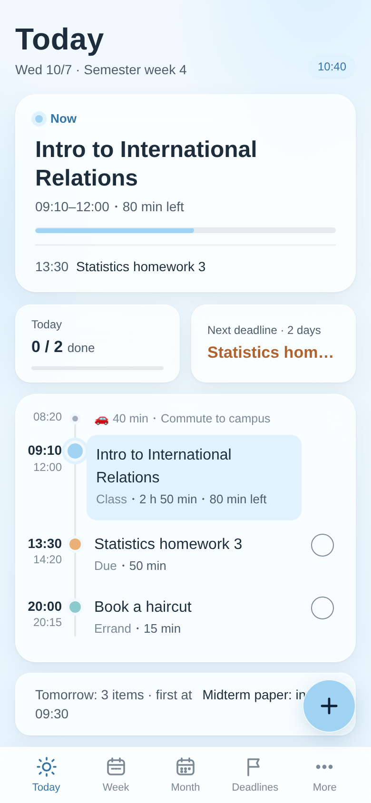
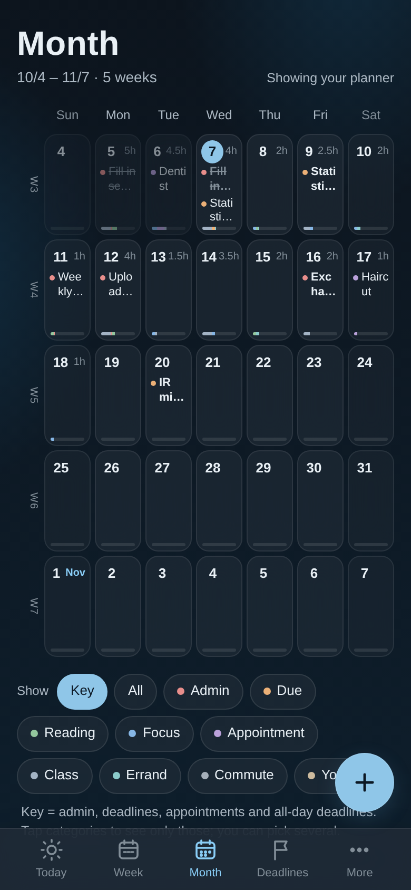
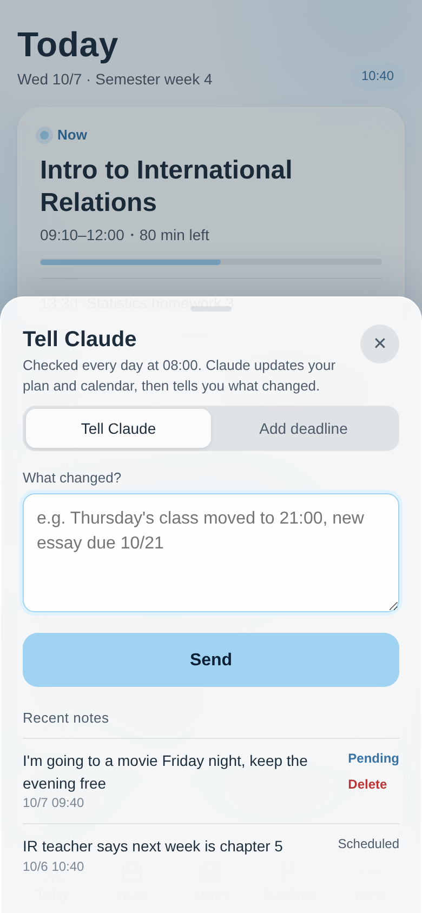

# Weekly Planner: Complete User Guide

[中文](guide.md) · [Back to README](../README.md) · [GitHub project](https://github.com/Liviaaaaa33333/Weekly-Planner-Skill)

This guide covers everything from installation to troubleshooting. If you're new, work through chapters 1–6 and you'll be up and running. Come back to chapter 12 if something goes wrong.

**Contents**

1. [What this project is](#1-what-this-project-is)
2. [Why it's designed this way](#2-why-its-designed-this-way)
3. [What you need before you start](#3-what-you-need-before-you-start)
4. [Install the skill](#4-install-the-skill)
5. [Connect Google Calendar](#5-connect-google-calendar)
6. [First-time setup](#6-first-time-setup)
7. [Scheduled tasks: weekly check-in and daily check](#7-scheduled-tasks-weekly-check-in-and-daily-check)
8. [Using it day to day](#8-using-it-day-to-day)
9. [Finding and protecting your planner page](#9-finding-and-protecting-your-planner-page)
10. [Using it on your phone](#10-using-it-on-your-phone)
11. [Changing settings and usage limits](#11-changing-settings-and-usage-limits)
12. [Troubleshooting](#12-troubleshooting)
13. [Updating, pausing and removing](#13-updating-pausing-and-removing)
14. [FAQ](#14-faq)
15. [Disclaimer](#15-disclaimer)

---

## 1. What this project is

This is a Claude skill that pairs an AI assistant with your schedule. It's built on two of Claude's own features:

- **Scheduled tasks:** Claude wakes up on its own at set times. Once a week it sends you a draft of next week's plan to confirm, and once a day it checks for any changes you've left.
- **An interactive page:** a web page that belongs only to you, laid out like a phone app with Today, Week, Month and Deadlines tabs. It shows what to do right now and a countdown to your deadlines, and you tick things off as you finish them.

Add the Google Calendar connector and your plan shows up in your phone's calendar, with reminders on time.

It was designed around ADHD. The goal is to give people who find it hard to plan their own time a real shot at a more organized life. Anyone who struggles to divide up their time can use it too.

The project started as something the author built for their own daily life. After using it for a while, they turned it into a public version anyone can set up. It is not an official Anthropic product.

## 2. Why it's designed this way

Most time management tools assume you'll decide for yourself when to do what. For people with ADHD, that's often exactly the hard part: you know what needs doing, but not which thing to start with, when to start, or how long it will take. Every design choice in this skill targets one of these common struggles:

| Common struggle | What this skill does |
| --- | --- |
| Not knowing what to do first | Sorts tasks by the priorities you set and tells you "do this at this time," instead of handing you a list of options |
| No sense of how long things take | Every task has a time estimate, and each week you're asked "too much / about right / too little" so it can adjust |
| Not knowing how to start a big task | Breaks papers and applications into small, doable steps, working backward from the deadline |
| Overpacking, so one bad day sinks the whole week | Caps focus blocks per day and keeps 30% of each week open |
| Small things are the easiest to forget and the costliest to miss | Admin tasks (sign-ups, payments, absence emails) always come first, as early as possible |
| Forgetting what you're supposed to be doing now | The "Right now" card at the top of the page tells you the moment you open it |
| Beating yourself up over unfinished work, then giving up | Unfinished tasks aren't judged, just moved to a later open slot |
| A sudden burst of motivation to finish early | Any time you free up is automatically used for what comes next |
| Rethinking everything from scratch every week | A draft arrives at the same time each week, and you only need to reply to confirm |

These choices are based on common everyday struggles. They are not medical advice and can't replace diagnosis or treatment (see chapter 15).

## 3. What you need before you start

| Item | Required? | Notes |
| --- | --- | --- |
| A paid Claude plan (Pro, Max, Team, Enterprise) | Required for automation | Scheduled tasks are only on paid plans. On the free plan you can still set up, plan and use the page; you just need to open a chat yourself each week and say "plan next week" |
| "Code execution and file creation" turned on | Required | Turn it on in Settings → Capabilities. Uploading a skill needs it |
| A Google account and the Google Calendar connector | Recommended | Writes your plan to your calendar with reminders. Only Google Calendar is supported |
| Class schedule, syllabi or work shifts | Recommended | Screenshots or PDFs are fine. Claude will read out weekly topics and exam dates |

Team or Enterprise plans: an organization admin first needs to allow skills in Organization settings.

## 4. Install the skill

1. Download [the English edition (weekly-planner-for-everyone-en.zip)](https://github.com/Liviaaaaa33333/Weekly-Planner-Skill/raw/main/dist/weekly-planner-for-everyone-en.zip) or [the Chinese edition (weekly-planner-for-everyone-zh.zip)](https://github.com/Liviaaaaa33333/Weekly-Planner-Skill/raw/main/dist/weekly-planner-for-everyone-zh.zip); the links download the file directly. You can also find them in the `dist/` folder of the [GitHub project](https://github.com/Liviaaaaa33333/Weekly-Planner-Skill). They do the same thing, so you only need one. **Don't unzip it.**
2. In claude.ai or the Claude desktop app, open **Settings → Capabilities** and make sure **Code execution and file creation** is on.
3. Open **Customize → Skills**, click **+** → **Upload a skill**, and choose the zip you downloaded.
4. Make sure `weekly-planner-for-everyone` is switched on in the list.

Menu names may change as Claude's interface is updated. If you can't find something, see [Claude Help Center: Use Skills in Claude](https://support.claude.com/en/articles/12512180-use-skills-in-claude).

## 5. Connect Google Calendar

If you don't want your plan in a calendar, skip this chapter. Your plan will only show on the page.

1. In claude.ai, open **Customize → Connectors**.
2. Find **Google Calendar** and click **Connect**.
3. Sign in to the Google account you want your plan in, and allow Claude to access your calendar.
4. Back in Connectors, check that Google Calendar shows **Connected**.

**Fewer "allow" prompts:** Claude may ask for permission every time it uses a calendar tool. In Connectors, open Google Calendar and set **Tool permissions** to **Always allow**, or pick **Always allow** when the prompt appears in a chat.

For now, it's best to add connectors on a computer. Once connected there, they work in the mobile app too.

See also: [Use Google Workspace connectors](https://support.claude.com/en/articles/10166901-use-google-workspace-connectors).

## 6. First-time setup

Start a new chat and type "set up my weekly planner." Claude will first explain that automation needs a paid plan, then ask which setup you want:

- **Quick setup (about 5 minutes, recommended):** just four questions; everything else uses defaults.
- **Full setup (about 20–30 minutes):** covers commuting, focus times, priorities, reminders, routines and long-term projects in one go.

### Example quick-setup conversation

> **Claude:** Four questions and we can get started:
> 1. What should I call you? What time zone are you in? Should I put your plan in Google Calendar?
> 2. Please upload your class schedule or regular commitments (a screenshot, syllabus or shift schedule all work).
> 3. What's the earliest I should schedule things each day, and the latest?
> 4. What deadlines, exams or appointments do you already know about?
>
> **You:** Call me Alex. New York time, and yes, put it in Google Calendar. My schedule is attached. 9 a.m. to 11 p.m. every day. Exchange program application due 10/9 at noon, IR midterm paper 10/13, Statistics midterm 11/4.
>
> **Claude:** Here's what I have: … (lists your classes, deadlines, and which defaults it used) Does this look right?
>
> **You:** Yes.

Once you confirm, Claude will:

1. Create your planner page.
2. Plan the rest of this week, show you a table, and write it to your calendar once you confirm.
3. Add major deadlines for the next 4 weeks as all-day events.
4. Create two scheduled tasks: a weekly check-in (default Sunday 20:00) and a daily check (default 08:00).

**Defaults:** focus work in the evening, up to 3 blocks a day, 25–50 minutes each with 20-minute breaks, 30% of the week kept open, priorities "admin > deadlines > reading > appointments > small tasks," messages checked once a day, and mid-week changes made directly and reported to you afterward. You can change any of these later (chapter 11).

**Syllabus tip:** upload each course's syllabus PDF and Claude will put each week's readings in the Classes tab and schedule pre-class reading automatically. Anything the syllabus doesn't make clear is marked "To confirm" rather than guessed.

## 7. Scheduled tasks: weekly check-in and daily check

Scheduled tasks are what let this project run on its own, and they need a paid plan. They run in the cloud, so they keep working even when your computer is off or the app is closed.

### What the two tasks do

**Weekly check-in (default Sunday 20:00)**
1. Reads your page and rolls anything unfinished from last week into next week.
2. Drafts next week's plan and sends it to you: a one-line overview, a day-by-day table, and major deadlines for the next three weeks.
3. Asks just two questions: Anything new next week, like assignments, appointments or plans without a fixed time? Were last week's time estimates too much, about right or too little?
4. Writes to your calendar only after you reply to confirm. To skip this step, tell Claude "Write the weekly plan straight to my calendar, don't wait for me": from then on it goes straight in, the message says it's already in your calendar, and you just reply if anything should change.

**Daily check (default 08:00, once a day)**
- Handles new messages you've left in Tell Claude.
- Syncs what you ticked on the page to your calendar: a ticked item gets "✅" in its event title and loses its reminder; unticking removes the ✅.
- Handles tasks you finished early and uses the freed-up time for what comes next.
- If anything changed, sends you a sentence or two about it; if nothing did, it leaves you alone.

### Turn on "Automatically approve" (important)

When a scheduled task runs, nobody is there to click "allow." If a task's approval mode is manual, it will stop at the first step that needs permission.

1. In Claude's left sidebar, click **Scheduled** and find the two weekly planner tasks.
2. Open each task's settings and set the approval mode to **Automatically approve**.
3. Do this for both tasks.

In this mode, Claude still checks that each action is safe before taking it. On Team or Enterprise plans an admin may have turned this option off. If so, open a chat yourself each week and say "plan next week."

### Notifications

You'll get a notification when a task finishes. Allow notifications for the Claude app in your phone's system settings so you don't miss the weekly draft. Tap the notification to go straight to that task's chat and reply.

### More you can do in Scheduled

- **Run now:** if you want to re-plan right away, choose to run the task immediately.
- **Pause:** pause tasks during a break so you aren't disturbed, then resume later.
- **View history:** see the result of every past run. If a task seems unresponsive, start here (chapter 12).

See also: [Schedule recurring tasks](https://support.claude.com/en/articles/13854387-schedule-recurring-tasks-in-claude-cowork).

## 8. Using it day to day

### Reading the page

Open your planner page. There are five tabs at the bottom and a "＋" button at the bottom right:

| Tab | What's in it |
| --- | --- |
| Today | The "Now" card at the top: what this block is for, when it ends and how many minutes are left; when you're free, how long until the next thing. Below: today's progress, the nearest deadline, and today's timeline, a single line linking each item, with a blue line where you are now and commutes shrunk to one small line. Tick things off when done; classes and commutes don't need ticking |
| Week | A row of dates at the top. Tap a day (or swipe) to see just that day's timeline, with no endless scrolling. Small dots under each date show what kinds of things it has |
| Month | The next five weeks, with each day's key items in its cell. Filter chips below let you pick which categories to see (admin, deadlines, reading… several at once); tap a day to open everything on it from the bottom, and swipe to change days. With Google Calendar connected it reads your live calendar, so events you added yourself show up too |
| Deadlines | A countdown list with the days left in large type, orange within seven days and red when late. Tap one to see its note or delete it; finished ones are collapsed at the bottom |
| More | Next week (number of classes, hours of reading and focus, the busiest day, things not to forget, each course's topic, with each day collapsed to one line), Classes (what to read next, announcements, planned and covered topics for the whole term), Routines, and Rules (a summary of your settings) |

**The "＋" button** opens a sheet that switches between "Tell Claude" (write down any change; your recent notes are listed below) and "Add deadline".

The first time you open Month, the page may ask for permission to read your Google Calendar. Allow it.

  
  
  

### Telling Claude about changes

Just say it in any chat, or tap "＋" on the page and write it in Tell Claude. Messages left on the page are handled at the next daily check.

- "New assignment: book report due 10/21"
- "Thursday's class moved to 9 p.m." "Move next week's dentist to Friday"
- "From now on, three workouts a week"
- "The professor says we're doing chapter 5 next week" "No class on 10/21" "Midterm moved to 11/19"
- "What should I be doing right now?" "When is my haircut?": for any question about your schedule, Claude first reads the latest data on your page (including your notes) before answering
- "Statistics only got as far as the binomial distribution today": recorded in the "What we covered" column of the full schedule
- "Haircut is booked for Friday 1 p.m. the week after next": something already booked goes straight onto your calendar, without waiting until that week is planned
- "I'm wiped out today. Push this afternoon's stuff back"

### Ticking things off

Tick tasks off on the page when you finish them. This week and Deadlines stay in sync: tick off "Send recommendation letter," and the letter in Deadlines is marked done too.

Every tick is synced to your calendar at the next check: the event title gets "✅" and its reminder is cancelled; untick it and the ✅ comes off and the reminder comes back.

**Tick things off even when you finish early.** If you finish before the scheduled block, the next check also uses that time for later tasks.

### Deleting mistakes

If you add a deadline or a note by mistake, or add one twice, you can delete it on the page without waiting for Claude:

- **Deadlines:** tap the deadline to open it; "Delete" is underneath.
- **Tell Claude:** tap "＋"; among your recent notes, only "Pending" ones can be deleted. "Scheduled" notes have already been handled, so deleting them wouldn't undo the changes; to change something, just leave a new note.

The first tap turns "Delete" into "Delete?". Tap again within 4 seconds to delete; otherwise it resets, so a stray tap on your phone does nothing. Deleted items are removed from your data and leave no trace on the page. **Deleting can't be undone.**

It's best to delete before Claude plans the item. If a deadline has already been planned, Claude's next check removes its all-day calendar event and any prep blocks made just for it, and tells you.

## 9. Finding and protecting your planner page

- **Finding the page:** go to **Artifacts** in the left sidebar, or straight to [claude.ai/artifacts](https://claude.ai/artifacts), and look for the page with "Weekly planner" in its title. You can also just ask Claude, "Give me the link to my weekly planner page."
- **Who can see it:** by default, only you. It holds your class schedule, plans and appointments, so we **don't recommend** using Share to set it to "Anyone with the link."
- **Where the data lives:** your plan data is stored in the page's own database (20 MB limit, which normal use won't fill for years), not in chats, so nothing is lost when you switch chats or devices.
- **Switching devices:** just open the same link on any device signed in to the same Claude account.

## 10. Using it on your phone

### Turn the page into an iPhone web app

1. Open your planner page in **Safari** and sign in to Claude.
2. Tap "⋯" next to the address bar or the share button, then choose **Share** → **Add to Home Screen**.
3. Give it a name you'll recognize, like "Weekly planner"; leave **Open as Web App** on, and tap **Add**.
4. The first time you open it from the Home Screen, you may need to sign in to Claude again inside it.

Button names vary a little between iOS versions. On Android, use Chrome's "Add to Home screen."

### See Google Calendar in Apple Calendar

- **iPhone:** Settings → Apps → Calendar → Calendar Accounts → Add Account → Google. Sign in and turn on Calendars.
- **Mac:** System Settings → Internet Accounts → Add Account → Google, then check Calendars.

Apple Calendar shows the whole Google calendar in one color, so you won't see the category colors Claude sets. Google Calendar reminders don't always go off after syncing to Apple Calendar. If they don't, install the Google Calendar app and turn on its notifications.

## 11. Changing settings and usage limits

### Change settings anytime by just saying so

| You want to | Tell Claude |
| --- | --- |
| Change your available hours | "Don't schedule anything after 10 p.m." |
| Change your focus time | "I focus better in the morning now" |
| Loosen things up | "Max 2 focus blocks a day" "Leave more open time" |
| Change the weekly check-in time | "Move the weekly check-in to Saturday morning" |
| Change how often the daily check runs | "Check three times a day: morning, noon and evening" |
| Be asked before changes | "Ask me before changing my calendar": mid-week changes are sent to you first and only made once you agree |
| Skip the weekly confirmation | "Write the weekly plan straight to my calendar, don't wait for me": the plan goes in as soon as it's made; say if anything should change |
| Change the page language | "Switch the page to Chinese" |
| Add a routine | "Haircut every 6 weeks, remind me a week ahead to book it" |

Changed settings show up in the page's Rules tab.

### Usage limits

Paid plans have two usage limits: one per 5 hours and one per week. Scheduled tasks read your page, plan and write to your calendar, so they use more than ordinary questions do.

- **The daily check runs once a day by default.** With no new messages it finishes quickly, but it still uses a little of your limit. If you want faster responses, increase it to 2–3 times.
- If you're close to your limit, drop the daily check back to once a day and tell Claude about important changes directly in chat.
- If you hit your limit, a task may not finish. The next run will pick up any messages still waiting.

See also: [How do usage and length limits work](https://support.claude.com/en/articles/11647753-how-do-usage-and-length-limits-work).

## 12. Troubleshooting

**No draft for next week arrived on Sunday**
1. In the left sidebar, open **Scheduled**, find the weekly check-in task and look at its latest run.
2. If it's stuck waiting for approval, turn on **Automatically approve** as described in chapter 7.
3. If the task is paused, resume it.
4. If you can't wait, open a chat and say "plan next week."

**The daily check doesn't seem to do anything**
When there are no new messages and nothing finished early, the daily check doesn't send a message. That's normal. Only a message still marked "Pending" hasn't been handled yet; you can run the task manually once in Scheduled.

**My plan isn't showing up in my calendar**
1. Check that Google Calendar shows Connected in Customize → Connectors.
2. Make sure you're looking at the calendar for the same Google account.
3. If the plan's status is "Draft, waiting for you," it hasn't been written to your calendar yet. Just reply to confirm.
4. Tell Claude, "Re-sync this week's plan to my calendar."

**The page says "This view can't load your data. Open it on claude.ai."**
You're looking at a preview or a signed-out version. Sign in to claude.ai in your browser and open the link again. For the Home Screen web app, sign in again inside it.

**All-day events show up on the previous day**
Tell Claude, "Check the dates of the all-day deadlines in my calendar," and it will fix them.

**"Allow" prompts keep popping up**
- In chats: choose **Always allow** when the prompt appears. You only need to do this once per tool.
- Connector: set Google Calendar's Tool permissions to Always allow, as in chapter 5.
- Scheduled tasks: turn on Automatically approve.

**Times look wrong**
The page uses the time zone you set, not your device's. If you travel or move, say "Change my time zone to Asia/Tokyo."

**The plan is too packed or too loose**
Answer "too much" or "too little" at the weekly check-in, and the next estimates will adjust by about 20%. You can also change the limits directly (chapter 11).

**Claude got a time or date wrong**
Just tell it what's wrong and it will fix the page and your calendar. For important deadlines, always go by your school's or the official announcement.

Still stuck? Feel free to open an Issue on GitHub. Include your plan, the platform you're using (web, desktop, mobile) and any error message you see, but **don't paste your personal schedule or page link**.

## 13. Updating, pausing and removing

### Updating to a new version

1. Download the new zip, delete the old skill in Customize → Skills, then upload the new one.
2. Tell Claude, "Update my weekly planner page." It will read your current page, switch it to the new template, and keep any title and color changes you made. Your data lives in the page's database, so nothing is lost.

For what changed in each version, see the [CHANGELOG](../CHANGELOG.md).

### Pausing and removing

Tell Claude how far you want to go. It will list the steps and ask you to confirm first:

- **Pause automatic checks:** "Pause my weekly planner's scheduled tasks." Say "resume" later to turn them back on.
- **Clear plans from your calendar:** "Delete the calendar events Claude scheduled." Only events with the "[Planned by Claude]" marker in their description are deleted, and by default only those from today on.
- **Delete the page:** "Delete my weekly planner page." This can't be undone.
- **Remove the skill:** turn it off or delete it in Customize → Skills.
- **Disconnect your calendar:** Customize → Connectors → Google Calendar → Disconnect.

## 14. FAQ

**Do I have to open a chat myself every week?** Not on a paid plan. The scheduled task sends you a notification; just tap it and reply. On the free plan, open a chat yourself and say "plan next week."

**Will it remember what's already been planned?** Yes. Your data lives on your planner page, which is read before every planning run. It doesn't rely on chat memory.

**Will it mess with calendar events I created myself?** No. It only changes events with the "[Planned by Claude]" marker in their description (the Chinese edition uses "[Claude安排]").

**Can I use Outlook, or only Apple Calendar?** For now, only Google Calendar can be written to. If you use another calendar, you can use just the page, or create a Google account only for your plan and add it to Apple Calendar.

**Can I use it if I'm not a student?** Yes. If you don't set a semester, the page won't show semester weeks, and you can swap your class schedule for work shifts or regular meetings.

**What if I live somewhere with daylight saving time?** No problem. The page and calendar both convert automatically based on the time zone you set (for example, `America/New_York`).

**Can two people share one page?** This skill is designed for individuals. Each person should set up their own page.

## 15. Disclaimer

- **Not a medical tool.** This project was designed around everyday struggles common with ADHD, but it can't replace diagnosis, treatment or professional help. If you're going through a hard time, please talk to a doctor, a therapist or someone you trust.
- **Not an official Anthropic product.** This is an unofficial skill for Claude, with no partnership with or endorsement from Anthropic. Claude is a trademark of Anthropic.
- **AI can make mistakes.** Claude may schedule the wrong time or misread a date. For important deadlines like registrations, payments and exams, always go by your school's or the official announcement.
- **Your data.** Your plan data lives in your own Claude account and Google Calendar and is handled under Anthropic's and Google's privacy policies. This project itself collects no data.
